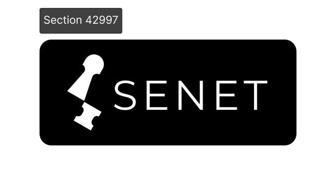

  
  <h1>🙋 Welcome to senet.wiki!</h1>

*SENET was inspired by the board game invented by ancient Egyptians more than 5,000 years ago, which means “crossing”. They believed that the movement of chess pieces from one end of the board to the other was like a soul traveling through the underworld to the afterlife. At first, SENET was just a board game for entertainment, but soon extended with religious meanings.*

Here, the term SENET takes on new significance:

**▪️ Discover the value of the game.** Games are common to all civilizations, as old as the origin of humanity.

**▪️ Give connotation to the game.** Integrate it into daily life like the ancient Egyptians did.

**▪️ Use games to connect more people and a bigger world, finally create and remain traces of civilization in our era.**

This is Senet's first Alpha version of the encyclopedia, and we are still working on it, and we hope more enthusiasts will join us in building it.

We plan to write some products and services that are currently developing in the first phase. Below is the directory.

### Join our Discord server

We have a space to discuss all things senet – share your ideas or just say hi over [on Discord](https://discord.com/invite/qh9dG9EwQx).