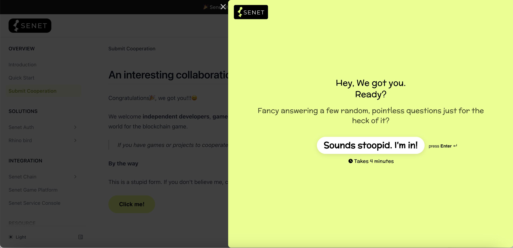

## An interesting collaboration

Congratulations🎉, we got you!!!😄

We welcome **independent developers**, **game companies**, **investors**, etc. to join **SENET** to create a wonderful world for the blockchain game. 

>If you have games or projects to cooperate, try the following button.

**By the way**

This is a stupid form. If you don't believe me, click on it.👇

 
 
  <button 
    data-tf-slider="o7QT1rQu" 
    data-tf-position="right" 
    data-tf-opacity="100" 
    data-tf-iframe-props="title=Senet Wiki Form" 
    data-tf-transitive-search-params 
    data-tf-medium="snippet" 
    style={{ 
      all: 'unset', 
      fontFamily: 'Helvetica,Arial,sans-serif',
      display: 'inline-block',
      maxWidth: '100%',
      whiteSpace: 'nowrap',
      overflow: 'hidden',
      textOverflow: 'ellipsis',
      backgroundColor: '#E5FF84',
      color: '#000',
      fontSize: '16px',
      borderRadius: '25px',
      padding: '0 30px',
      fontWeight: 'bold',
      height: '50px',
      cursor: 'pointer',
      lineHeight: '50px',
      textAlign: 'center',
      margin: '0',
      textDecoration: 'none'
    }}>Click me!</button>
  

😊If it has no response after clicking, then please wait after refreshing.
